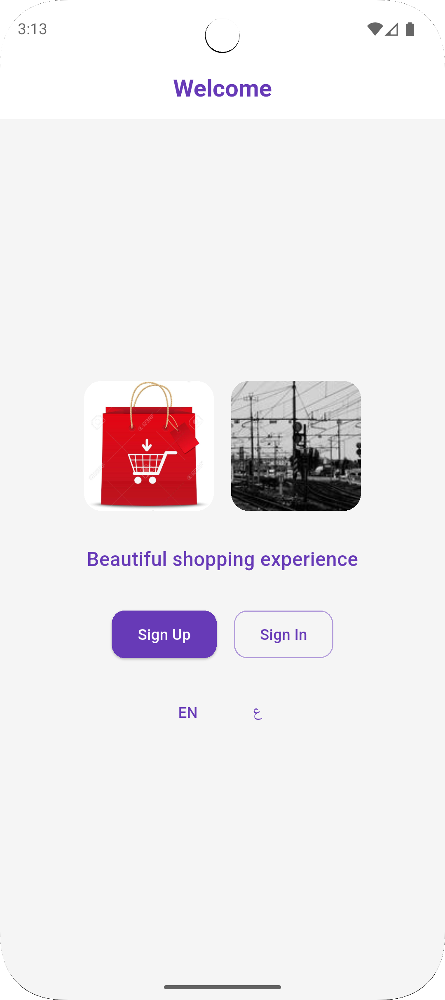
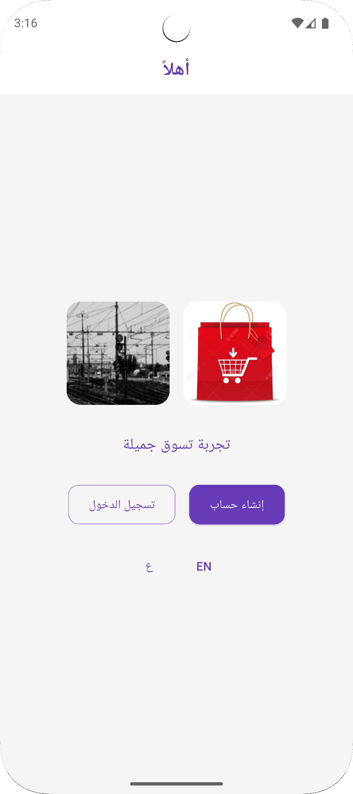
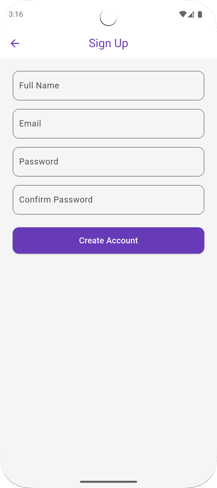
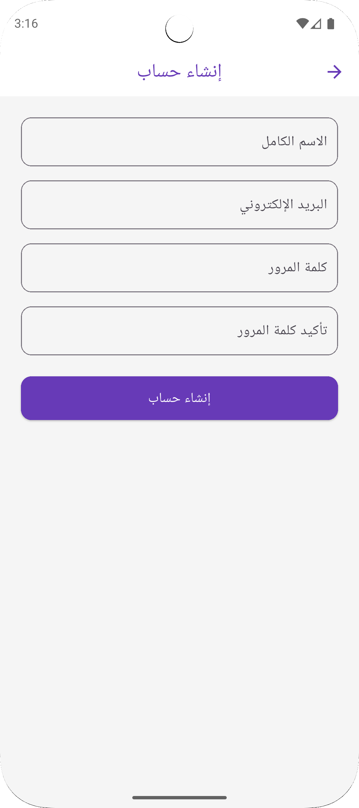
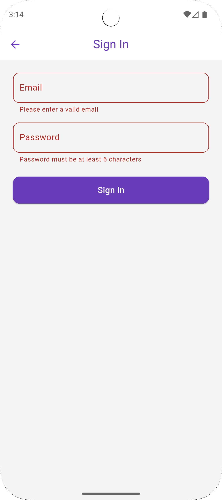
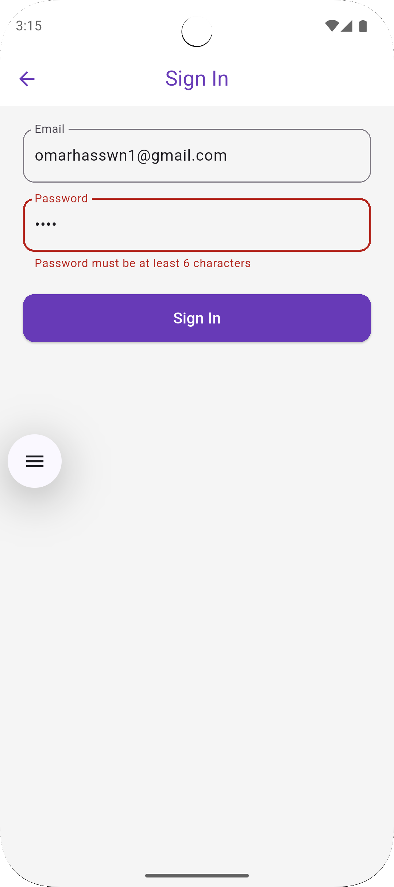
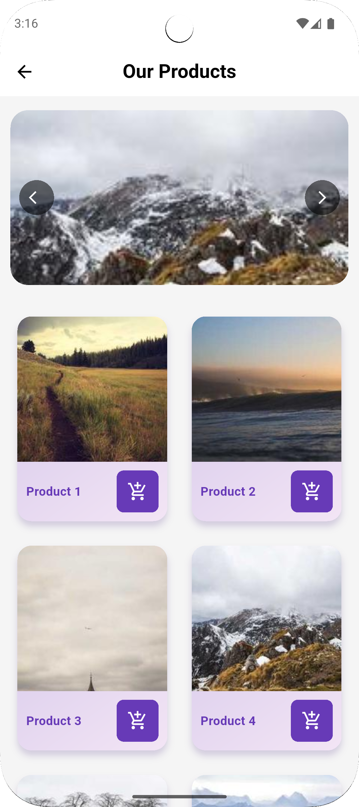
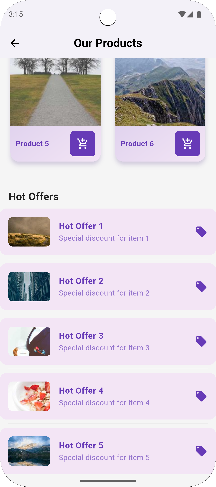

# 🛍️ Flutter Shopping App

A simple **shopping app** built with **Flutter** featuring:

* **Multilingual support (EN / AR)**
* **Authentication (Sign Up / Sign In)**
* **Smooth animated navigation**
* **Product catalog & hot offers**
* **Modern UI with purple theme**

---

## ✨ Features

* **Welcome Screen**

    * App intro with images
    * Language toggle (English / Arabic)
    * Navigation to Sign Up / Sign In

* **Sign Up Screen**

    * Create a new account with name, email, and password
    * Validations (email format, password length, matching password, name starts with capital)
    * Success dialog with smooth fade transition to Home

* **Sign In Screen**

    * Login with email and password
    * Form validations
    * Success dialog with fade transition to Home

* **Home Screen**

    * PageView for featured products with **left/right navigation buttons**
    * Grid of products with **add-to-cart button**
    * Hot offers list with styled ListTiles

---

## 🖼️ Screenshots

<p align="center">
  
  
  
  
</p>

<p align="center">
  
  
  
  
</p>

---

## 🛠️ Tech Stack

* **Flutter** (latest stable)
* **Dart**
* **Material Design**
* **AppLocalizations** (for i18n support)

---

## 📂 Project Structure

```
lib/
│── l10n/                 
│── screens/
│   ├── welcome_screen.dart
│   ├── signup_screen.dart
│   ├── signin_screen.dart
│   └── home_screen.dart
│── widgets/
│   └── product_card.dart
│── main.dart
```

---

## 🚀 Getting Started

1. Clone the repository:

   ```bash
   git clone https://github.com/omarhassandev1/shopping_app.git
   cd flutter-shopping-app
   ```

2. Install dependencies:

   ```bash
   flutter pub get
   ```

3. Run the app:

   ```bash
   flutter run
   ```

---

## 🌍 Localization

* English (`en`)
* Arabic (`ar`)

Easily switch between languages from the **Welcome Screen**.

---

## 📌 Notes

* Dummy images are loaded from [Picsum Photos](https://picsum.photos/).
* Snackbar is shown when adding a product to cart.
* UI follows **modern card-based design with purple theme**.

---

## 👨‍💻 Author

Developed by **Omar Hassan Abdelfattah** 💜

Feel free to fork and customize this project!
